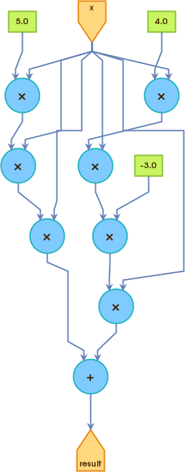
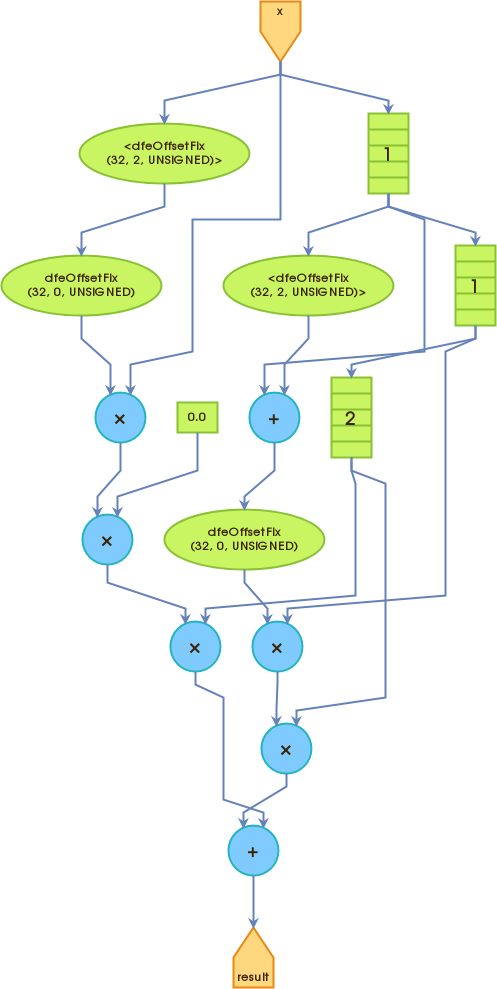

# Maxeller HW1 mathematic operation

## Overview
This project implements a Maxeller kernel that takes a stream of values and returns the same stream. 
The kernel is designed using MaxCompiler, which utilizes an extended version of Java called MaxJ. 
The code is written in Java with files having the .maxj extension.

## Project Structure
The project consists of the following components:

- **Kernel Code**: The main logic is implemented in the PassThroughKernel class, which extends the Maxeler Kernel class. The kernel takes an input stream 'x', performs a mathematical operation:
  

- **Manager**: Describes the data flow choreography between Kernels, the DFE’s memory, and the CPU.

- **SLiC Skin**: Enables communication between the CPU and DFE.

### Clone the repository to your local machine.
```bash
git clone https://github.com/dzaja123/Dataflow-HW1-mathematical-operation-Maxeler.git
```

## Execution Graph for a Mathematical Function
This section provides an overview of the execution graph for a mathematical function within the MaxCompiler application.

### Execution Graph Overview
The execution graph for the mathematical function is represented as a series of interconnected nodes and edges, illustrating the flow of computation on the Maxeler platform. 
This graph encapsulates the pipeline of arithmetic units and the orchestrated data flow managed by the MaxCompiler.

### Graph Visualization




# Maxeller Overview
## CPU Code
The CPU code is an integral part of the application, working in tandem with the dataflow kernel. 
It interacts with the kernel through the SLiC Skin, enabling seamless communication between the CPU and DFE.

## Kernel
The kernel is designed as a graph of pipelined arithmetic units, providing efficient computation on the Maxeler platform. 
The Manager component plays a crucial role in describing the data flow choreography between various elements, including Kernels, the DFE’s memory, and the CPU.

## Manager
The Standard Manager, provided with MaxCompiler, serves as a general-purpose Manager supporting:
- A single Kernel
- External LMem interfaces
- Linking between multiple dataflow engines
- Links to the CPU
- Debugging

## Debugging
Debugging capabilities are enhanced through the use of `simPrintf`, allowing explicit printing of values from streams within the Kernel on every tick. 
This behavior mirrors the functionality of `printf` in C. To conditionally print messages, a Boolean `DFEVar` stream can be supplied as a condition.

## Software and Hardware Variables
The application employs both software and hardware variables. Software variables exist during compilation time, while hardware variables exist during execution time.

### Hardware Variables
- Floating-point type parameterized with mantissa and exponent bit-widths
- Fixed-point type with parameterizable size and binary point offset
- Unsigned integer
- Signed integer
- Boolean
- `DFERawBits` streams are used to prevent invalid operations
- `DFEComplex`/`DFEVector` variables allow multiple variables to be grouped together.

## Scalar Values and Streams of Data
Transfer single values to and from the DFE at runtime using `io.scalarInput(name, dfe_type)`. Scalar inputs can be set dynamically at runtime by the CPU application.

Dataflow computing operates on windows into data streams, minimizing off-chip data transfers by holding the data window in on-chip memory on the dataflow engine. 
Stream offsetting allows access to data elements within a stream relative to the current location.
